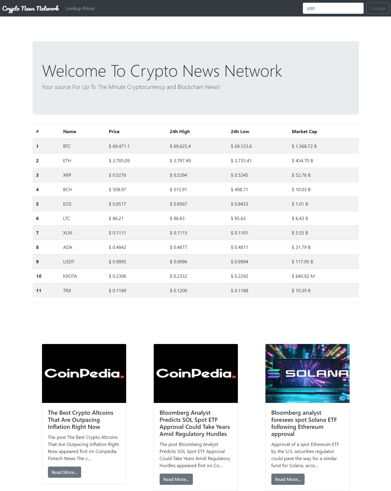
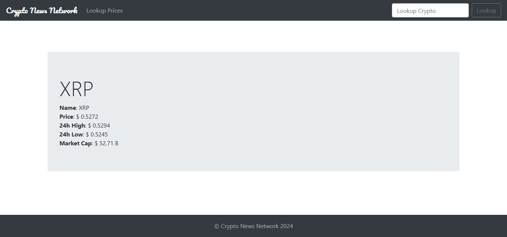

# CryptoCurrencyNewsNetwork
A cryptocurrency django project is a project that uses cryptocompare api and display latest news about crypto currency and shows the currency data.

<h2>Project snapshot</h2>
# Home Page

# Search Page
